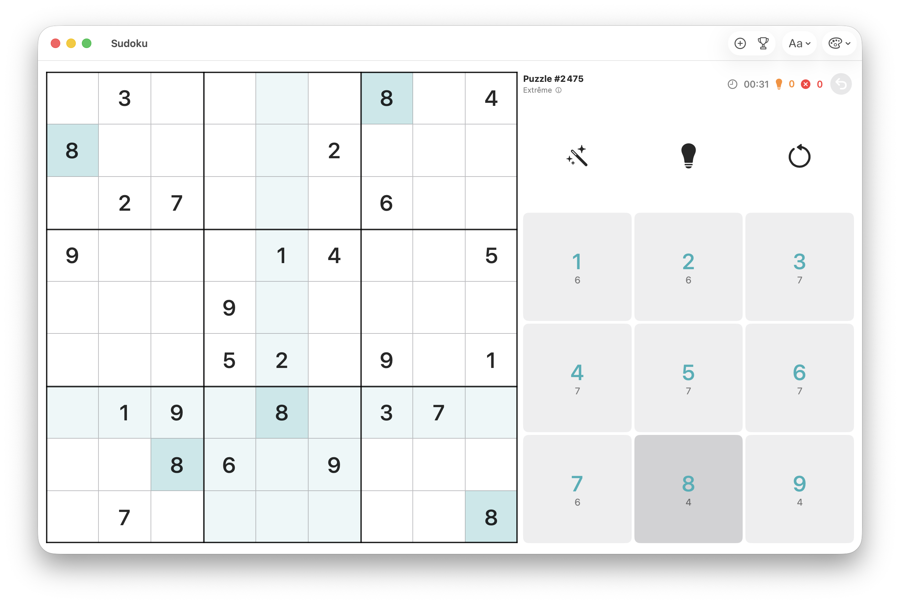

# Sudoku

A Sudoku app for macOS and iOS.

## Release Notes

### Current Release

This release turns the app into a full-featured Sudoku companion for both casual and advanced players. It combines a clean SwiftUI board, touch-friendly controls, guided solving tools, persistent progress, and completion tracking across a bundled catalog of puzzles.

- Play on both macOS and iOS with a layout that adapts to portrait and landscape orientations.
- Start a new game from six difficulty tiers: Easy, Medium, Hard, Expert, Extreme, and Diabolical.
- Load a specific puzzle directly by entering its puzzle ID.
- Solve puzzles from a built-in catalog that stores metadata such as puzzle number, difficulty, and required solving techniques.
- See the current puzzle number and difficulty at a glance in the header.
- Open the technique popover to inspect which logical methods are associated with the current puzzle.
- Track your session with a live timer, a hint counter, and an error counter.
- Use undo to roll back previous actions during a run.
- Select digits from a dedicated keypad that also shows how many placements remain for each number.
- Tap a cell to select it and highlight its row, column, block, and matching digits for easier scanning.
- Enter pencil marks by selecting a digit and tapping an empty editable cell.
- Place a value by double-tapping a cell while a digit is selected.
- Clear an editable filled cell with a long press.
- Detect conflicts immediately, including wrong guesses and invalid candidate notes.
- Toggle a candidate view to display generated possibilities across the grid.
- Automatically prune notes after placements and deletions so candidates stay consistent with the current board state.
- Request smart hints powered by a technique detector instead of generic help.
- Browse hint chains step by step with a dedicated hints screen, board preview, visual legend, explanation text, and reasoning breakdown.
- Receive support for a wide range of Sudoku strategies, from Naked Singles and Hidden Singles to X-Wing, Swordfish, Jellyfish, XY-Wing, XYZ-Wing, WXYZ-Wing, Alternating Inference Chains, and Forcing Chains.
- Reveal the correct value for the selected cell when no logical hint is available.
- Detect when a puzzle has become trivial and offer one-tap auto-completion for the remaining naked singles.
- Enjoy completion feedback with animated celebrations for completed rows, columns, and boxes.
- Finish a puzzle with a dedicated victory screen and fireworks overlay.
- Save the current game state automatically, including board progress, elapsed time, hints used, errors made, puzzle ID, difficulty, and techniques.
- Resume the last saved game automatically on the next launch.
- Record completed puzzles with completion date, solving time, hint count, and error count.
- Review completed puzzles in a dedicated history screen.
- Sort completed puzzles by difficulty, hints used, errors, or solving time.
- Replay any completed puzzle directly from the completion history.
- Personalize the interface with multiple accent colors.
- Switch between a standard font and a handwriting-style font for a different play feel.
